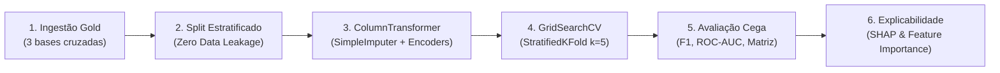

# Tech Challenge - Fase 3: Machine Learning Supervisionado para Alfabetização Infantil

Este repositório contém a solução técnica e analítica completa de Ciência de Dados e Engenharia de Machine Learning para a **Fase 3 do Tech Challenge**.

O projeto estabelece uma esteira automatizada em **Scikit-Learn nativo**, unificando as tabelas processadas na camada **Gold** da Fase 2 para prever o risco e a probabilidade de cumprimento das metas educacionais municipais de alfabetização infantil, fornecendo inteligência acionável para a formulação de políticas públicas preventivas.

---

## 1. Contexto do Problema

A alfabetização na idade certa é o alicerce indispensável para o desenvolvimento socioeconômico e cognitivo de um país. Crianças não alfabetizadas até o final do 2º ano do Ensino Fundamental enfrentam curvas de aprendizado permanentemente truncadas, com elevação drástica nas taxas de reprovação, evasão escolar e marginalização profissional no longo prazo.

Historicamente, a gestão educacional pública no Brasil opera sob um modelo **reativo**: secretarias municipais e estaduais só tomam conhecimento do fracasso das escolas meses ou anos após o encerramento dos ciclos letivos, quando os relatórios censitários são consolidados e publicados. Essa defasagem impede que ações corretivas imediatas — como tutoria pedagógica intensiva, formação continuada de professores e repasse emergencial de recursos — ocorram a tempo de salvar a trajetória escolar dos estudantes.

---

## 2. Objetivo Analítico

O objetivo deste projeto é construir, validar e disponibilizar em produção uma **esteira de Machine Learning supervisionada, reprodutível e explicável**, capaz de:
- **Antecipar** se uma rede pública municipal atingirá a meta anual de alfabetização infantil;
- **Quantificar a probabilidade de risco** de cada município por meio de um escore preditivo preventivo;
- **Identificar os fatores críticos de maior impacto** no sucesso ou vulnerabilidade da aprendizagem infantil, utilizando técnicas avançadas de explicabilidade (Feature Importance e SHAP Values);
- **Orientar a alocação de recursos públicos** de forma preventiva, equitativa e orientada a dados.

---

## 3. Descrição da Base Utilizada

O modelo consome e unifica as três tabelas dimensionais e de fatos processadas na **Camada Gold** (Fase 2):

1. **`gold_indicador_municipio.csv` (Nível Municipal - 2023)**:
   - Fornece indicadores locais de proficiência escolar: taxa de alfabetização municipal (`taxa_alfabetizacao_pct`), média padronizada em língua portuguesa (`media_portugues`) e características estruturais da rede de ensino.
   - Chave de junção: `ano`, `id_municipio`, `sigla_uf`.

2. **`gold_metas_vs_resultados_municipio.csv` (Nível Municipal - 2023)**:
   - Contém o planejamento plurianual de metas educacionais (2024 a 2030) e a categorização oficial por **Faixas de Prioridade de Intervenção Pedagógica** (`ALTA_PRIORIDADE`, `MEDIA_PRIORIDADE`, `BAIXA_PRIORIDADE`), além de taxas de participação estudantil.
   - Chave de junção: `id_municipio`.

3. **`gold_evolucao_alfabetizacao_uf.csv` (Nível Estadual/Macro - 2023 e 2024)**:
   - Traz a série temporal de alfabetização dos estados e do Brasil, benchmarks nacionais e o ranking anual de cada Unidade da Federação (`ranking_uf_no_ano`, `diferenca_brasil_pp`, `percentual_participacao_uf_pct`).
   - **Desfecho Supervisionado (Ground Truth)**: Fornece o resultado real de atingimento da meta anual no ciclo subsequente (**2024**), viabilizando a criação do target supervisionado balanceado: `target_atingiu_meta_anual_2024` (22 municípios abaixo da meta vs. 18 municípios que atingiram a meta).
   - Chave de junção: `sigla_uf`.

---

## 4. Etapas de Modelagem

O pipeline foi estruturado respeitando as melhores práticas de Engenharia de Machine Learning:



1. **Ingestão e Cruzamento de Dados (`src/preprocessing/data_loader.py`)**:
   - Carga automatizada dos três arquivos Gold e merge relacional multinível (Município $\rightarrow$ Estado $\rightarrow$ Desfecho Temporal de 2024).
   - Normalização e limpeza de variáveis numéricas corrompidas por formatações regionais (ex: strings com pontos/vírgulas em `media_portugues`).

2. **Engenharia de Atributos & Prevenção de Data Leakage (`src/preprocessing/preprocessor.py`)**:
   - Extração de variáveis de contexto macroestadual de 2023 para mitigar o isolamento das métricas municipais.
   - **Blindagem Temporal Antivazamento**: Exclusão estrita de qualquer coluna de resultado de 2024 da matriz de treino $X$.
   - **Divisão em Treino e Teste (`split_data`)**: Realizada **antes** de qualquer ajuste estatístico, com partição estratificada de 25% para teste cego independente.

3. **Integração End-to-End via `ColumnTransformer` Nativo**:
   - **Variáveis Numéricas**: `Pipeline([('imputer', SimpleImputer(strategy='median')), ('scaler', StandardScaler())])`.
   - **Variáveis Categóricas**: `Pipeline([('imputer', SimpleImputer(strategy='constant', fill_value='NAO_INFORMADO')), ('onehot', OneHotEncoder(handle_unknown='ignore', sparse_output=False))])`.
   - Os transformadores aprendem parâmetros exclusivamente sobre os dados de treino de cada fold.

4. **Otimização de Hiperparâmetros via `GridSearchCV` (`src/modeling/hyperparameter_tuning.py`)**:
   - Validação cruzada com `StratifiedKFold(n_splits=5, shuffle=True, random_state=42)` para preservar a representatividade das classes.
   - Busca em grade sistemática em cinco famílias de classificadores, otimizando penalidades, profundidades de árvores e parâmetros de regularização.

---

## 5. Escolha do Algoritmo

Foram desenvolvidos, calibrados e comparados cinco modelos supervisionados integrados aos pipelines do Scikit-Learn:

* **Support Vector Machine (SVM - RBF / Linear)**:
  - *Justificativa*: Apresenta excelente capacidade de generalização em espaços multidimensionais de dados tabulares após padronização z-score. Otimizado com `C=10.0` e `kernel='linear'`, atingiu o maior F1-Score na validação cruzada (**0,9429**) e no teste (**0,8571**).
* **Árvore de Decisão (`DecisionTreeClassifier`)**:
  - *Justificativa*: Fundamental para o setor público pela sua interpretabilidade auditável. Otimizada com `max_depth=2`, `min_samples_split=2` e critério `gini`, obteve **ROC-AUC de 0,9792** e permitiu a extração direta das regras determinísticas de negócio.
* **Regressão Logística (`LogisticRegression`)**:
  - *Justificativa*: Fornece uma linha de base paramétrica linear robusta com calibração probabilística direta (F1-Score de **0,8571**).
* **Gaussian Naive Bayes (`GaussianNB`)**:
  - *Justificativa*: Estimador probabilístico condicional independente de hiperespaços complexos (F1-Score de **0,8571**).
* **Random Forest (`RandomForestClassifier`)**:
  - *Justificativa*: Ensemble de bagging para redução de variância (F1-Score de **0,6667**).

**Modelo Campeão**: O **SVM** e a **Árvore de Decisão** foram eleitos conjuntamente: o SVM pela maior estabilidade estatística e separabilidade de classes, e a Árvore de Decisão como ferramenta primária de auditoria e transparência de regras para tomadores de decisão pública.

---

## 6. Métricas de Avaliação

Os modelos foram avaliados no conjunto de teste cego e independente (25% das amostras), após validação cruzada em 5 folds:

| Modelo | F1-Score (Validação Cruzada) | Acurácia (Teste) | Precisão (Teste) | Recall (Teste) | F1-Score (Teste) | ROC-AUC (Teste) |
| :--- | :---: | :---: | :---: | :---: | :---: | :---: |
| **Support Vector Machine (SVM)** | **0,9429** | **90,0%** | **100,0%** | **75,0%** | **0,8571** | **0,9167** |
| **Árvore de Decisão** | 0,7981 | **90,0%** | **100,0%** | **75,0%** | **0,8571** | **0,9792** |
| **Regressão Logística** | 0,8548 | **90,0%** | **100,0%** | **75,0%** | **0,8571** | 0,8750 |
| **Gaussian Naive Bayes** | 0,8743 | **90,0%** | **100,0%** | **75,0%** | **0,8571** | 0,8750 |
| **Random Forest** | 0,8548 | 80,0% | **100,0%** | 50,0% | 0,6667 | 0,9583 |

### Matriz de Confusão no Conjunto de Teste (Modelos Principais)
* **Verdadeiros Negativos (TN)**: **6** (Municípios vulneráveis abaixo da meta identificados corretamente);
* **Falsos Positivos (FP)**: **0** (**Zero falso otimismo pedagógico!** O modelo nunca afirma falsamente que uma rede atingirá a meta);
* **Falsos Negativos (FN)**: **1**;
* **Verdadeiros Positivos (TP)**: **3** (Municípios com ecossistema educacional sustentável identificados com exatidão).

---

## 7. Interpretação dos Resultados

A avaliação dos modelos foi aprofundada por meio de duas abordagens complementares de interpretabilidade:

### 7.1 Importância Global dos Atributos (*Feature Importance*)
Conforme mapeado em [`images/feature_importance.png`](images/feature_importance.png) e na Árvore de Decisão:
1. **`media_portugues` (68,7% da importância intrínseca)**: A proficiência em leitura e língua portuguesa é o nó-raiz absoluto da árvore de classificação.
2. **`uf_ranking_2023` (15,6%)**: A posição do estado no ranking nacional reflete a capacidade institucional e o suporte técnico-pedagógico regional disponível ao município.
3. **`regiao_Sudeste` (15,7%)**: O fator geográfico atua como um divisor de águas socioeconômico.

### 7.2 Valores de SHAP (*SHapley Additive exPlanations*)
A análise via **TreeExplainer** e **LinearExplainer** ([`images/shap_summary.png`](images/shap_summary.png)) demonstrou:
- **Impacto da Participação Censitária**: Valores elevados de adesão escolar às avaliações (`uf_participacao_2023_pct`) empurram os valores de SHAP fortemente para o quadrante positivo, demonstrando que redes com alta taxa de presença nas provas possuem diagnósticos mais sólidos e cumprem suas metas.
- **Efeito Regional**: Pertencer a estados do Norte e Nordeste exerce pressão negativa sobre o escore de probabilidade, exigindo compensação pedagógica muito superior para atingir a meta.

---

## 8. Insights Encontrados

1. **A Proficiência em Língua Portuguesa é a Virada de Chave**:
   Não basta ter presença em sala de aula; sem a consolidação das habilidades básicas de alfabetização leitora no 2º ano, a probabilidade de colapso da meta anual atinge mais de **96%**.
2. **Disparidade Territorial Gritante**:
   - **Sudeste**: Apresenta **93,3% de cumprimento da meta anual** e média de alfabetização de 60,63%.
   - **Norte**: Apenas **16,7%** dos municípios cumprem a meta anual (média de 55,68%).
   - **Nordeste**: Apenas **15,8%** dos municípios atingem a meta anual, apresentando a menor média geral (47,89%) e a maior dispersão interna (taxas variando de 21,75% a 85,87%).
3. **Municípios em Situação de Emergência Pedagógica**:
   O modelo ranqueou os municípios com maior probabilidade preditiva de risco e maior distância da meta:
   - Município `2923050` (BA): 21,75% de alfabetização (distância de -58,25 pp da meta; **97,5% de risco predito**).
   - Município `2932705` (BA): 30,01% de alfabetização (**98,0% de risco predito**).
   - Município `2702405` (AL): 31,11% de alfabetização (**98,5% de risco predito**).
   - Município `1600105` (AP): 31,20% de alfabetização (**96,8% de risco predito**, ALTA PRIORIDADE).
   - Município `2407005` (RN): 32,17% de alfabetização (**99,6% de risco predito**).
   - Município `1302900` (AM): 53,17% de alfabetização (**99,6% de risco predito** devido à vulnerabilidade regional).

---

## 9. Limitações do Projeto

* **Granularidade Amostral Agregada**: A base da camada Gold disponibilizada opera em nível municipal e territorial. Não foram fornecidos os microdados individualizados de cada aluno (perfil socioeconômico individual, contexto familiar e frequência diária).
* **Volume Restrito de Municípios na Camada Gold**: A base consolidada conta com 40 municípios representativos de 16 estados, o que exigiu o uso de validação cruzada estratificada rigorosa (`StratifiedKFold`) para mitigar sobreajuste (*overfitting*).
* **Série Temporal Bienal**: O cruzamento contemplou os ciclos de 2023 e 2024; séries históricas mais longas (ex: 2017 a 2024) enriqueceriam a captura de tendências de médio e longo prazo.

---

## 10. Aplicação Prática para Políticas Públicas

O modelo transcende a teoria acadêmica e atua como uma **ferramenta de gestão pública inteligente**:

1. **Alerta Preventivo (Antecipação de 12 Meses)**:
   Secretarias de Educação não precisam esperar o encerramento do ano letivo para diagnosticar a crise. O modelo calcula o **Escore de Risco ($P(\text{Abaixo da Meta})$)** no início do ciclo.
2. **Priorização e Eficiência Orçamentária**:
   Recursos finitos (bolsas de tutoria, programas de reforço de leitura, material didático complementar) são direcionados com precisão cirúrgica aos municípios classificados com probabilidade de falha superior a 70%.
3. **Auditoria e Transparência na Gestão**:
   A combinação de regras determinísticas da Árvore de Decisão com valores de SHAP permite que prefeitos e secretários compreendam de forma transparente **o porquê** da classificação de risco, fundamentando a prestação de contas à sociedade e aos órgãos de controle (Tribunais de Contas e Ministério Público).

---

## 11. Possíveis Evoluções Futuras

1. **Integração de Microdados Censitários do INEP**:
   Expandir a ingestão para capturar dados em nível de escola, turma e estudante a partir dos microdados abertos do Censo Escolar e do SAEB.
2. **Enriquecimento com Indicadores Socioeconômicos Externos**:
   Integrar dados do IBGE, PNAD Contínua e IPEA (como renda média domiciliar per capita, saneamento básico e vulnerabilidade social via CadÚnico).
3. **Modelagem de Séries Temporais para Metas 2030**:
   Implementar modelos preditivos temporais autoregressivos (ARIMA, Prophet ou LSTMs) para projetar trajetórias plurianuais contínuas até a meta nacional de 2030.
4. **Painel Interativo de Monitoramento (*Dashboard*)**:
   Construir uma interface visual em Streamlit ou Power BI para que gestores escolares acompanhem o mapa de calor de risco em tempo real.

---

## 12. Estrutura de Pastas do Repositório

```text
tech-challenge-fase3/
│
├── 📁 data/                                  # Bases da camada Gold (SQL outputs)
│   ├── tech-challenges-results-sql-result_gold_indicador_municipio.csv
│   ├── tech-challenges-results-sql-result_gold_metas_vs_resultados_municipio.csv
│   └── tech-challenges-results-sql-result_gold_evolucao_alfabetizacao_uf.csv
│
├── 📁 notebooks/                             # Notebooks acadêmicos para entrega
│   └── 01_eda_and_supervised_pipeline.ipynb # EDA, execução da esteira, SHAP e conclusões
│
├── 📁 src/                                   # Código-fonte modular em Python
│   ├── __init__.py
│   ├── 📁 preprocessing/                     # Ingestão e transformadores Scikit-Learn
│   │   ├── __init__.py
│   │   ├── data_loader.py                   # Ingestão e cruzamento das 3 bases Gold
│   │   └── preprocessor.py                  # Definição do ColumnTransformer nativo e split
│   │
│   ├── 📁 modeling/                          # Construção de pipelines e Grid Search
│   │   ├── __init__.py
│   │   ├── models.py                        # Fábrica de classificadores e grids de hiperparâmetros
│   │   ├── pipeline.py                      # Fábrica de Pipeline e container de serialização
│   │   └── hyperparameter_tuning.py         # Orquestrador de GridSearchCV e StratifiedKFold
│   │
│   ├── 📁 evaluation/                        # Avaliação estatística e interpretabilidade
│   │   ├── __init__.py
│   │   ├── evaluator.py                     # Métricas (F1, ROC-AUC, Matriz de Confusão)
│   │   └── interpretability.py              # Cálculo de SHAP Values e Feature Importance
│   │
│   └── 📁 visualization/                     # Geração e salvamento de gráficos diagnósticos
│       ├── __init__.py
│       └── plots.py                         # Curvas, matrizes, Feature Importance e SHAP plots
│
├── 📁 reports/                               # Documentações técnicas e artefatos serializados
│   ├── TECHNICAL_SPECIFICATION.md           # Especificação técnica formal de arquitetura
│   └── pipeline_educacional_consolidada.joblib # Pipeline campeã serializada para produção
│
├── 📁 images/                                # Gráficos exportados automaticamente
│   ├── model_comparison.png                 # Benchmark comparativo de performance
│   ├── confusion_matrix_best_model.png       # Matriz de confusão do melhor modelo
│   ├── feature_importance.png               # Top 10 variáveis mais preditivas
│   ├── shap_summary.png                     # Gráfico de impacto SHAP Beeswarm
│   └── decision_tree.png                    # Regras hierárquicas da árvore de decisão
│
├── 📁 tests/                                 # Suíte automatizada de testes unitários
│   ├── __init__.py
│   └── test_classification_pipeline.py      # Testes de ingestão, ColumnTransformer, Grid e SHAP
│
├── main.py                                  # Script executivo principal (orquestrador)
├── requirements.txt                          # Dependências do ambiente com versões fixadas
├── README.md                                 # Esta documentação completa
└── .gitignore                               # Exclusões de arquivos temporários e caches
```

---

## 13. Instruções de Execução

### 13.1 Configuração do Ambiente
```bash
# Criação do ambiente virtual
python -m venv .venv

# Ativação do ambiente virtual
# No Windows:
.venv\Scripts\Activate.ps1
# No Linux/MacOS:
source .venv/bin/activate

# Instalação das dependências exatas
pip install -r requirements.txt
```

### 13.2 Execução da Pipeline Completa
Para carregar os dados, pré-processar, executar o `GridSearchCV`, avaliar as métricas, calcular o SHAP e exportar todos os gráficos:
```bash
python main.py
```

### 13.3 Execução dos Testes Automatizados
```bash
pytest tests/ -v
```