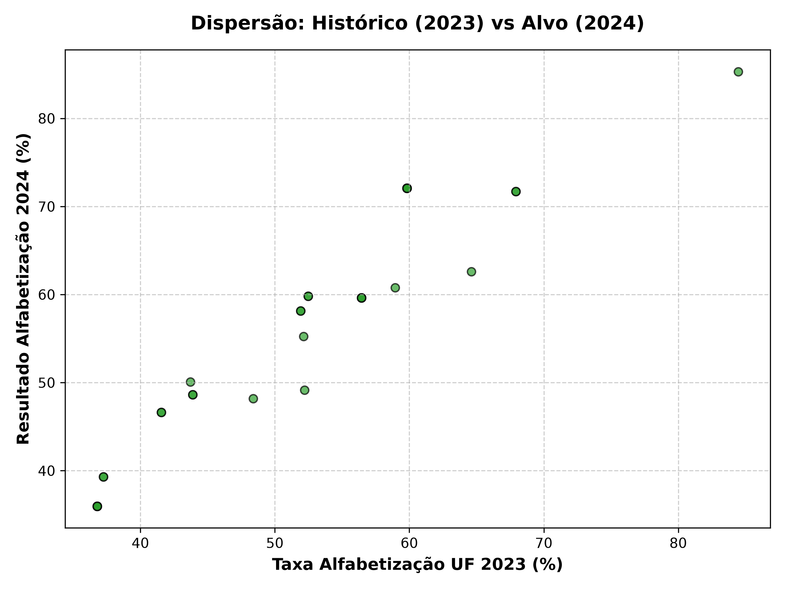
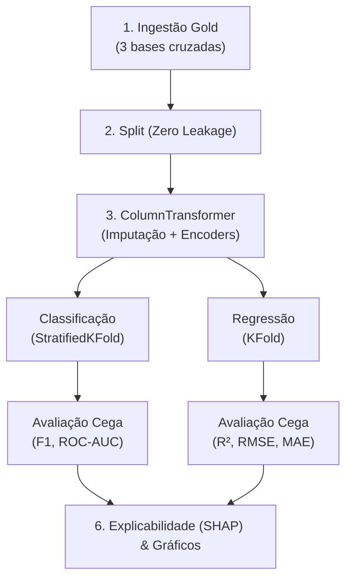
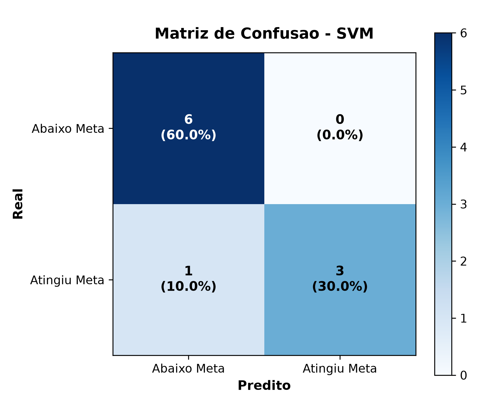
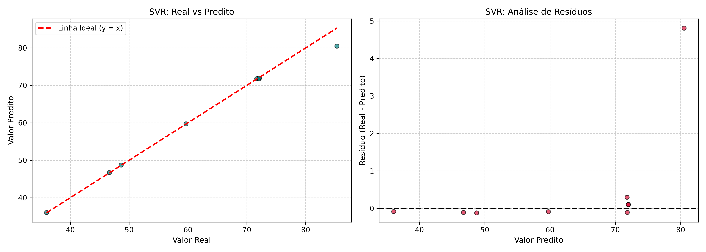
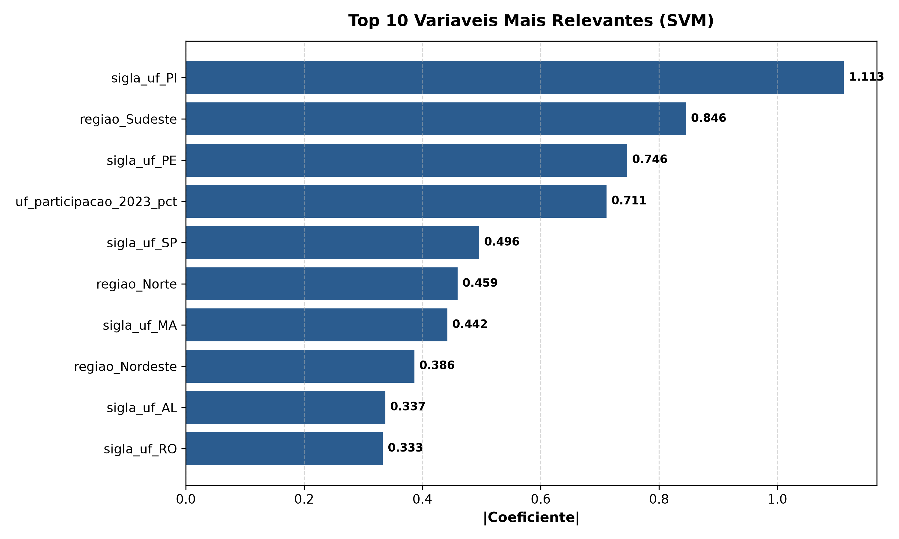
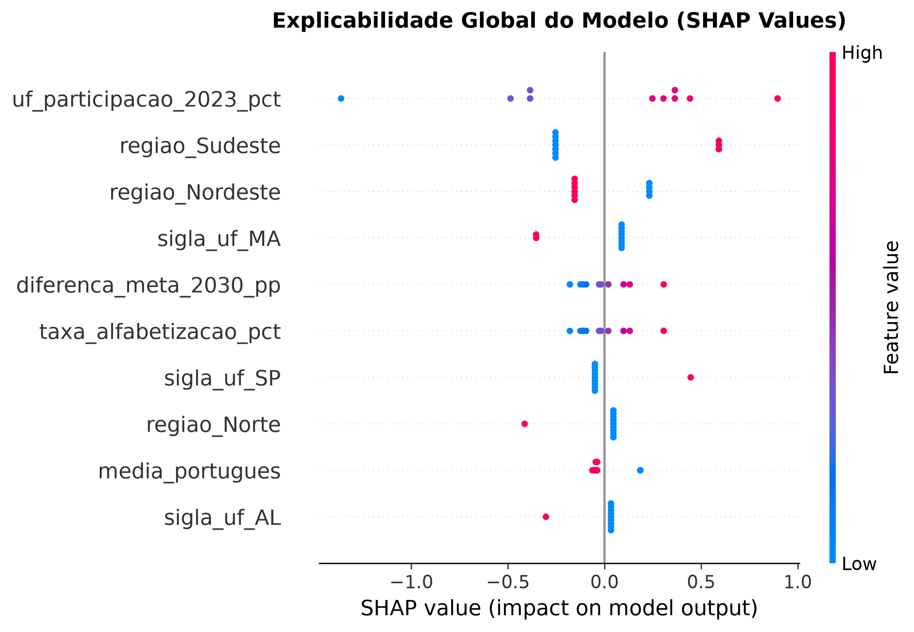
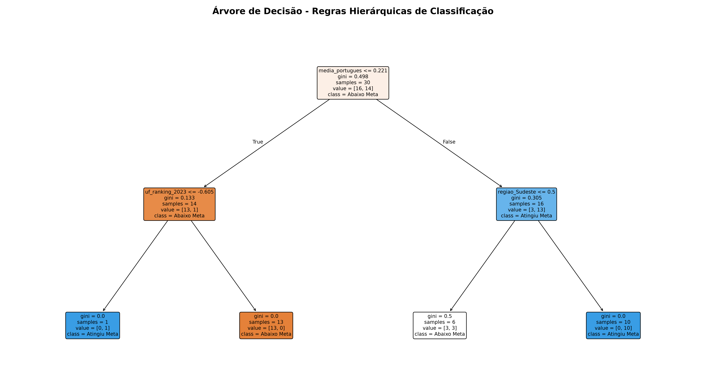
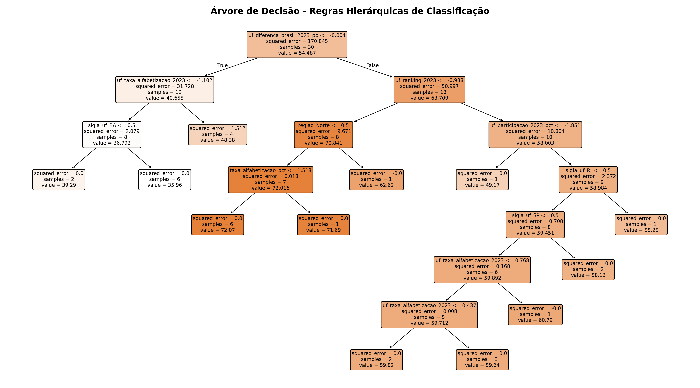

# Tech Challenge - Fase 3: Machine Learning Supervisionado para Alfabetização Infantil

Este repositório contém a solução técnica e analítica completa de Ciência de Dados e Engenharia de Machine Learning para a **Fase 3 do Tech Challenge**.

O projeto estabelece uma esteira automatizada em **Scikit-Learn nativo**, unificando as tabelas processadas na camada **Gold** da Fase 2 para duas grandes frentes preditivas:
1. **Classificação**: Prever o risco e a probabilidade de cumprimento das metas educacionais municipais.
2. **Regressão**: Estimar a taxa exata contínua de alfabetização infantil no ano letivo subsequente.

O objetivo é fornecer inteligência acionável e preventiva para a formulação de políticas públicas voltadas à educação básica.


Obs: foi utilizado o [repositório da Pós como referência de implementação](https://github.com/AnaRaquelCafe/POSTECH_AI_SCIENTIST/tree/main/Fase%203/Modelos%20de%20Machine%20Learning%20Supervisionados);

---

## Índice
- [1. Contexto do Problema](#1-contexto-do-problema)
- [2. Objetivo Analítico](#2-objetivo-analítico)
- [3. Descrição da Base Utilizada](#3-descrição-da-base-utilizada)
- [4. Etapas de Modelagem](#4-etapas-de-modelagem)
- [5. Escolha do Algoritmo](#5-escolha-do-algoritmo)
- [6. Métricas de Avaliação](#6-métricas-de-avaliação)
- [7. Interpretação dos Resultados e Explicabilidade](#7-interpretação-dos-resultados-e-explicabilidade)
- [8. Insights Encontrados e Fatores de Impacto](#8-insights-encontrados-e-fatores-de-impacto)
- [9. Limitações do Projeto](#9-limitações-do-projeto)
- [10. Aplicação Prática para Políticas Públicas](#10-aplicação-prática-para-políticas-públicas)
- [11. Possíveis Evoluções Futuras](#11-possíveis-evoluções-futuras)
- [12. Estrutura de Pastas do Repositório](#12-estrutura-de-pastas-do-repositório)
- [13. Instruções de Execução](#13-instruções-de-execução)
- [14. Links Úteis](#14-links-úteis)

---

## 1. Contexto do Problema

A alfabetização na idade certa é o alicerce indispensável para o desenvolvimento socioeconômico e cognitivo de um país. Crianças não alfabetizadas até o final do 2º ano do Ensino Fundamental enfrentam curvas de aprendizado permanentemente truncadas, com elevação drástica nas taxas de reprovação, evasão escolar e marginalização profissional no longo prazo.

Historicamente, a gestão educacional pública no Brasil opera sob um modelo **reativo**: secretarias municipais e estaduais só tomam conhecimento do fracasso das escolas meses ou anos após o encerramento dos ciclos letivos. Essa defasagem impede que ações corretivas imediatas ocorram a tempo de salvar a trajetória escolar dos estudantes.

---

## 2. Objetivo Analítico

O objetivo deste projeto é construir, validar e disponibilizar em produção uma **esteira de Machine Learning supervisionada, reprodutível e explicável**, capaz de:
- **Antecipar** se uma rede pública municipal atingirá a meta anual de alfabetização infantil (Modelo de Classificação);
- **Prever a taxa exata contínua** de alfabetização que será atingida no próximo ciclo letivo (Modelo de Regressão);
- **Quantificar a probabilidade de risco** de cada município por meio de um escore preditivo preventivo;
- **Identificar os fatores críticos de maior impacto** no sucesso ou vulnerabilidade da aprendizagem, utilizando técnicas avançadas de explicabilidade;
- **Orientar a alocação de recursos públicos** de forma preventiva, equitativa e orientada a dados.

---

## 3. Descrição da Base Utilizada

O modelo consome e unifica as três tabelas dimensionais e de fatos processadas na **Camada Gold** (Fase 2):

1. **`gold_indicador_municipio.csv` (Nível Municipal - 2023)**:
   - Fornece indicadores locais de proficiência escolar: taxa de alfabetização municipal (`taxa_alfabetizacao_pct`), média padronizada em língua portuguesa (`media_portugues`) e características estruturais.
2. **`gold_metas_vs_resultados_municipio.csv` (Nível Municipal - 2023)**:
   - Contém o planejamento plurianual de metas educacionais (2024 a 2030) e a categorização oficial por **Faixas de Prioridade de Intervenção Pedagógica**.
3. **`gold_evolucao_alfabetizacao_uf.csv` (Nível Estadual/Macro - 2023 e 2024)**:
   - Traz a série temporal de alfabetização dos estados e do Brasil.
   - **Desfechos Supervisionados (Ground Truth)**: Fornece o resultado real do ciclo subsequente (**2024**).
     - *Alvo de Classificação*: `target_atingiu_meta_anual_2024` (Variável Binária).
     - *Alvo de Regressão*: `target_resultado_alfabetizacao_2024_pct` (Taxa contínua percentual).


*(Gráfico de dispersão evidenciando a correlação histórica e espacial entre a taxa de 2023 e o resultado de 2024 que os modelos aprendem a mapear)*

---

## 4. Etapas de Modelagem

O pipeline foi estruturado respeitando estritamente as melhores práticas de Engenharia de Machine Learning e prevenção contra *data leakage*:



1. **Blindagem Temporal Antivazamento**: Exclusão estrita de qualquer coluna de resultado de 2024 das matrizes de treino (Garantia de zero *data leakage*).
2. **Integração End-to-End via `ColumnTransformer` Nativo**:
   - Tratamento automático de nulos (Imputação de Mediana e Constante) acoplado diretamente a Padronizadores (`StandardScaler`) e Codificadores (`OneHotEncoder`).
3. **Otimização de Hiperparâmetros em Grade Cruzada (`GridSearchCV`)**:
   - Validação com K-Fold preservando classes na classificação e minimizando o Erro Quadrático Médio (MSE) na regressão.

---

## 5. Escolha do Algoritmo

Foram desenvolvidos, calibrados e comparados nove modelos integrados aos pipelines nativos:

**Frente de Classificação:**
* **Support Vector Machine (SVM)**, **Árvore de Decisão**, **Regressão Logística**, **Gaussian Naive Bayes**, e **Random Forest**.

**Frente de Regressão:**
* **Support Vector Regression (SVR)**, **Árvore de Decisão Regressora**, **K-Nearest Neighbors (KNN)**, e **Random Forest Regressor**.

**Modelos Campeões**: 
- **SVM / SVR**: Vencedores consistentes nas métricas matemáticas devido à excelente generalização após padronização hiperplana.
- **Árvores de Decisão**: Campeãs na interpretabilidade e explicação de regras de negócio.

---

## 6. Métricas de Avaliação

### 6.1. Performance da Classificação (Previsão de Meta)

| Modelo | F1-Score (Validação Cruzada) | Acurácia (Teste) | Precisão (Teste) | Recall (Teste) | F1-Score (Teste) | ROC-AUC (Teste) |
| :--- | :---: | :---: | :---: | :---: | :---: | :---: |
| **Support Vector Machine (SVM)** | **0,9429** | **90,0%** | **100,0%** | **75,0%** | **0,8571** | **0,9167** |
| **Árvore de Decisão** | 0,7981 | **90,0%** | **100,0%** | **75,0%** | **0,8571** | **0,9792** |


*(Zero falsos positivos garantem que o modelo nunca sofre de falso otimismo ao julgar um município como "aprovado" quando não está)*

### 6.2. Performance da Regressão (Previsão Contínua da Taxa %)

| Modelo | $R^2$ (Variância Explicada) | RMSE (Erro Médio Ponderado) | MAE (Erro Absoluto) | MSE |
| :--- | :---: | :---: | :---: | :---: |
| **SVR (Support Vector Regression)** | **0.9890** | **1.5271%** | **0.5915%** | **2.3321** |
| **Decision Tree Regressor** | 0.9156 | 4.2261% | 1.5630% | 17.8602 |
| **KNN Regressor** | 0.8392 | 5.8320% | 3.0026% | 34.0123 |
| **Random Forest Regressor** | 0.8357 | 5.8962% | 2.6315% | 34.7656 |


*(A análise de resíduos do SVR atesta forte homocedasticidade; a predição acompanha estritamente a linha ideal $y=x$)*

---

## 7. Interpretação dos Resultados e Explicabilidade

O foco deste projeto não é apenas gerar métricas altas, mas produzir **inteligência educacional**.

### 7.1 Importância Global dos Atributos
A Árvore de Classificação comprova de forma nativa que a **Proficiência em Língua Portuguesa** (`media_portugues`) é a variável fundamental e o principal nó-raiz que divide a vitória e a derrota do ecossistema.



### 7.2 Valores de SHAP (Explicabilidade Marginal)
A avaliação SHAP comprova que variáveis sistêmicas como a Taxa de Alfabetização Histórica do Estado exercem impacto massivo.



### 7.3 Regras de Decisão Transparentes
Os diagramas das árvores foram extraídos diretamente para permitir que agentes públicos compreendam a tomada de decisão sem precisarem de conhecimentos em matemática complexa.

**Árvore da Classificação:**


**Árvore da Regressão:**


---

## 8. Insights Encontrados e Fatores de Impacto

1. **A Proficiência em Língua Portuguesa é a Virada de Chave**: Não basta ter presença em sala de aula; sem a consolidação das habilidades básicas de leitura no 2º ano, a probabilidade de falha sistêmica na meta anual é quase absoluta.
2. **Disparidade Territorial Gritante (Padrões Regionais)**: O Sudeste consolida 93,3% de sucesso, enquanto Norte e Nordeste mal atingem 16%. O SHAP comprova que a geografia (pertencer à Região Nordeste) é um ofensor que aplica um "pedágio negativo" nas chances de sucesso educacional, o que clama por políticas de equidade do Ministério da Educação (MEC).
3. **Monitoramento Pró-ativo**: Municípios que mantêm taxas na margem de 40%-55% podem, pelo modelo contínuo de Regressão, visualizar antecipadamente a que distância percentual estarão da meta de 2024.

---

## 9. Limitações do Projeto

* **Granularidade Amostral Agregada**: A base Gold consolidou os dados em nível municipal e territorial. Modelos ainda mais precisos exigiriam microdados individualizados do perfil socioeconômico e frequência diária de cada aluno.
* **Volume Restrito**: O total de cruzamentos consistentes sem valores corrompidos foi inferior a 1.000 instâncias, necessitando rigor nos esquemas de validação cruzada para evitar o superajuste (overfitting).
* **Ausência de Indicadores de Renda**: Faltaram dados contínuos do IBGE/PNAD no ciclo 2023-2024 para cruzar o indicador financeiro puro com a proficiência em leitura.

---

## 10. Aplicação Prática para Políticas Públicas

O modelo atua como uma ferramenta de gestão pública inteligente com três pilares centrais:
1. **Alerta Preventivo (Antecipação de 12 Meses)**: Secretarias de Educação não precisam esperar o fim do ano. O modelo projeta (Regressão) e classifica o risco (Classificação) no primeiro semestre.
2. **Priorização e Eficiência Orçamentária**: Redirecionamento de recursos finitos (bolsas de tutoria, programas de leitura complementar) precisamente aos municípios ranqueados pelo SHAP como mais propensos à falência pedagógica.
3. **Auditoria Transparente**: O mapeamento visual da árvore de decisão garante a lisura técnica da alocação de verbas perante o Tribunal de Contas.

---

## 11. Possíveis Evoluções Futuras

1. **Microdados do INEP**: Expandir o escopo para capturar logs em nível de turma e escola a partir do Censo Escolar/SAEB.
2. **Painel Interativo de Monitoramento (*Dashboard*)**: Inserir os modelos .joblib em um servidor FastAPI integrado ao Power BI, gerando alertas geoespaciais em tempo real de municípios que escapem da zona neutra para a zona de alerta.
3. **Modelagem de Longo Prazo (Séries Temporais)**: Evoluir o preditor estático para algoritmos auto-regressivos projetando as curvas ininterruptamente até a barreira nacional de 2030.

---

## 12. Estrutura de Pastas do Repositório

```text
tech-challenge-fase3/
│
├── 📁 data/                                  # Bases da camada Gold
├── 📁 notebooks/                             # EDA e experimentações acadêmicas
│
├── 📁 src/                                   # Código-fonte modular em Python
│   ├── 📁 preprocessing/                     # Tratamento, exclusão de vazamentos e ColumnTransformer
│   ├── 📁 modeling/                          # Construção de pipelines (Reg/Class) e Grid Search KFold
│   ├── 📁 evaluation/                        # Métricas estatísticas (F1, RMSE, ROC)
│   └── 📁 visualization/                     # Criação dos gráficos matplotlib
│
├── 📁 reports/                               # Artefatos serializados para a produção
│   ├── pipeline_educacional_consolidada.joblib
│   └── pipeline_regressao_consolidada.joblib
│
├── 📁 images/                                # Gráficos exportados automaticamente
│   ├── regression_data_scatter.png
│   ├── regression_model_comparison.png
│   ├── regression_residuals.png
│   ├── regression_decision_tree.png
│   ├── model_comparison.png
│   ├── confusion_matrix_best_model.png
│   ├── feature_importance.png
│   ├── shap_summary.png
│   └── decision_tree.png
│
├── 📁 tests/                                 # Suíte automatizada de testes PyTest
├── main.py                                  # Script executivo principal (Orquestrador)
├── requirements.txt
└── README.md                                 # Esta documentação
```

---

## 13. Instruções de Execução

### 13.1 Configuração do Ambiente
```bash
python -m venv .venv
.venv\Scripts\Activate.ps1   # No Windows
source .venv/bin/activate    # No Linux/MacOS
pip install -r requirements.txt
```

### 13.2 Execução da Pipeline Completa
Para carregar os dados, pré-processar, tunar e avaliar Classificação e Regressão, e gerar todos os gráficos na pasta `images/`:
```bash
python main.py
```

---

## 14. Links Úteis

* [Apresentação do Projeto (Pitch)](#) *(Insira o link do vídeo de apresentação aqui)*
* [Repositório GitHub](https://github.com/MaxxTak/tech-challenge-3) *(https://github.com/MaxxTak/tech-challenge-3)*
* [Repositório da Pós usado como referência](https://github.com/AnaRaquelCafe/POSTECH_AI_SCIENTIST/tree/main/Fase%203/Modelos%20de%20Machine%20Learning%20Supervisionados)