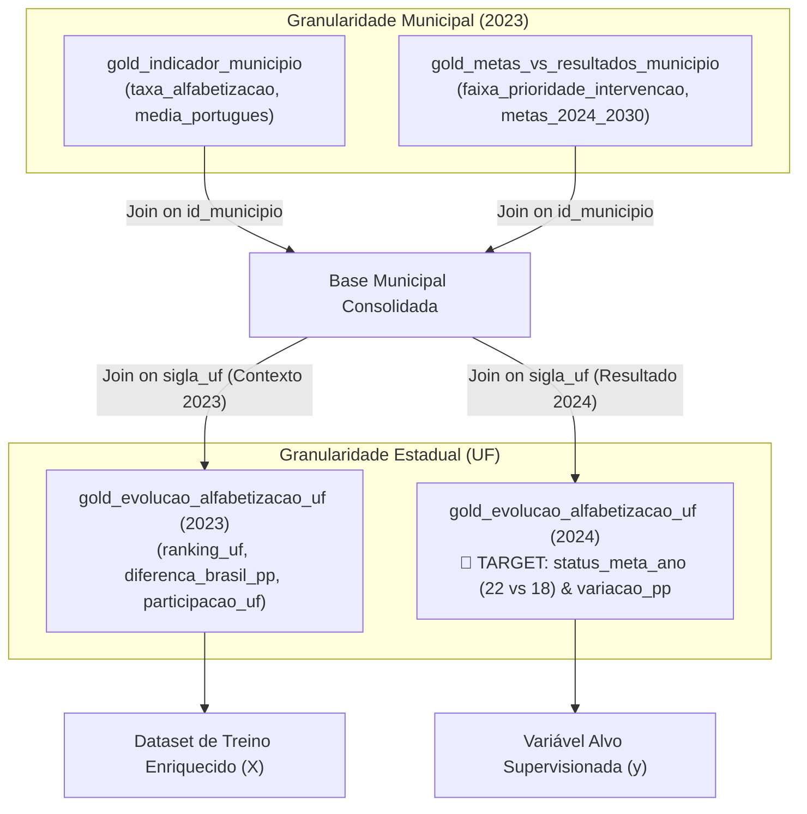

### 1. Entendimento e Papel de Cada Dataset

| Dataset | Granularidade | Registros | Chaves Primárias / Junção | Papel no Modelo |
| :--- | :--- | :--- | :--- | :--- |
| **`gold_indicador_municipio.csv`** | Municipal (2023) | 40 linhas | `ano`, `id_municipio`, `sigla_uf` | **Features Locais**: Taxa de alfabetização do município, média de português e indicadores operacionais. |
| **`gold_metas_vs_resultados_municipio.csv`** | Municipal (2023) | 40 linhas | `ano`, `id_municipio`, `sigla_uf` | **Features & Target Multiclasse**: Metas projetadas até 2030 e a coluna `faixa_prioridade_intervencao` (14 Alta, 13 Média, 13 Baixa). |
| **`gold_evolucao_alfabetizacao_uf.csv`** | Estadual / UF (2023 e 2024) | 40 linhas (20 em 2023, 20 em 2024) | `ano`, `sigla_uf` | **Macro-Contexto e Resultados Temporais**: Rankings, benchmarks nacionais e o resultado real de atingimento de meta em 2024. |

---

### 2. Verificação da sua Dica: Resultados ao Cruzar os Dados

Quando usamos apenas o arquivo `indicador_municipio`, o target de 2030 é muito desbalanceado (36 municípios abaixo da meta e apenas 4 acima). 

Ao cruzar os municípios com `evolucao_alfabetizacao_uf`, a tabela estadual desbloqueia os seguintes resultados:

#### A. Target Binário Equilibrado: `status_meta_ano` (Desfecho em 2024)
- Cruzando os municípios avaliados em 2023 com o resultado da sua respectiva UF em 2024:
  - **`ABAIXO_META_ANUAL`**: **22 municípios** (55%)
  - **`ATINGIU_META_ANUAL`**: **18 municípios** (45%)
- **Impacto no ML**: Transforma um dataset desbalanceado em um problema de classificação balanceado para prever se a rede pública do município pertence a um estado que baterá a meta do ciclo seguinte.

#### B. Target de Tendência / Evolução Real: `variacao_alfabetizacao_uf_pp`
- Revela a evolução real em pontos percentuais entre 2023 e 2024:
  - **Evolução Positiva (`variacao > 0`)**: 30 municípios
  - **Estagnação ou Queda (`variacao <= 0`)**: 10 municípios (ex: BA caiu -0.82 pp, PA caiu -0.18 pp, enquanto CE subiu +0.85 pp e MG subiu +8.87 pp).

#### C. Enriquecimento com Features Macro (Estado e Brasil em 2023)
- Ao invés de o modelo analisar o município de forma isolada, ganha variáveis macroeconômicas e regionais:
  - `ranking_uf_no_ano`: Posição do estado no ranking nacional.
  - `diferenca_brasil_pp`: Desempenho do estado comparado à média nacional (55,9% em 2023).
  - `percentual_participacao_uf_pct`: Taxa de adesão dos estudantes à avaliação censitária.

---

### 3. Como os 3 Datasets se Conectam

- **Cobertura de UFs**: 100% das 16 UFs presentes nos municípios estão contempladas na tabela `evolucao_alfabetizacao_uf`.
- **Interseção Municipal**: Dos 40 municípios de cada arquivo municipal, 25 cruzam perfeitamente por `id_municipio`, permitindo combinar indicadores locais com o nível de prioridade de intervenção.

---

### 4. Próximo Passo Recomendado

Podemos atualizar a função de ingestão em [`src/preprocessing/data_loader.py`](file:///c:/Users/thiag/Documents/postech/tech-challenge-3/src/preprocessing/data_loader.py) criando um método unificado (ex: `load_and_merge_all_datasets()`) que:
1. Une os indicadores municipais;
2. Agrega os atributos de contexto estadual e nacional (2023);
3. Utiliza a evolução/meta anual de 2024 da tabela `evolucao_alfabetizacao` como target de classificação supervisionada.

Deseja que eu implemente essa união dos 3 datasets na pipeline do `src/` e rode novamente os modelos de classificação com esse novo target balanceado?