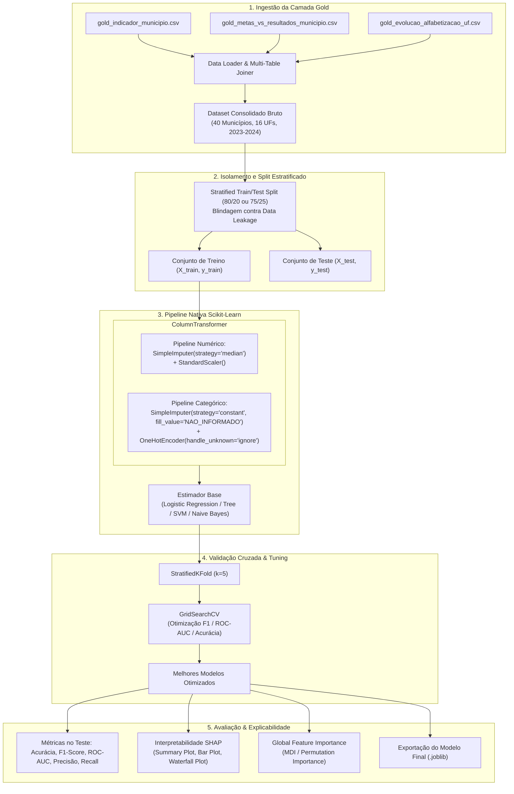

# Technical Specification - Pipeline de Machine Learning Supervisionado (Fase 3)

> **Documento:** Especificação Técnica de Arquitetura e Engenharia de Machine Learning  
> **Objetivo:** Atingir 100% de conformidade técnica com as diretrizes do Tech Challenge Fase 3  
> **Status:** Pronto para Implementação  
> **Versão:** 2.0.0  

---

## 1. Visão Geral e Arquitetura do Sistema

### 1.1 Objetivo Técnico
Construir uma esteira automatizada de Machine Learning em **Scikit-learn nativo** para ingestão da camada Gold, pré-processamento sem vazamento de dados (*leak-free*), validação cruzada estratificada com otimização de hiperparâmetros (`GridSearchCV`), avaliação multi-métrica e explicabilidade avançada via **Feature Importance** e **SHAP Values**.

### 1.2 Stack Tecnológica
- **Linguagem**: Python 3.10+
- **Processamento de Dados**: Pandas 2.x / 3.x, NumPy 1.24+ / 2.x
- **Modelagem & Pipelines**: Scikit-Learn (`Pipeline`, `ColumnTransformer`, `SimpleImputer`, `OneHotEncoder`, `StandardScaler`, `StratifiedKFold`, `GridSearchCV`, `LogisticRegression`, `DecisionTreeClassifier`, `SVC`, `GaussianNB`, `RandomForestClassifier`)
- **Interpretabilidade**: SHAP (`TreeExplainer`, `LinearExplainer`), Scikit-Learn (`permutation_importance`)
- **Visualização**: Matplotlib, Seaborn
- **Serialização**: Joblib
- **Qualidade & Testes**: Pytest

### 1.3 Diagrama de Arquitetura da Pipeline (End-to-End)



---

## 2. Estrutura Modular de Diretórios (Conformidade 100%)

```text
tech-challenge-fase3/
│
├── 📁 data/                                  # Datasets da camada Gold (SQL outputs)
│   ├── tech-challenges-results-sql-result_gold_indicador_municipio.csv
│   ├── tech-challenges-results-sql-result_gold_metas_vs_resultados_municipio.csv
│   └── tech-challenges-results-sql-result_gold_evolucao_alfabetizacao_uf.csv
│
├── 📁 notebooks/                             # Notebooks acadêmicos para entrega
│   └── 01_eda_and_supervised_pipeline.ipynb # Análise exploratória, treino, SHAP e conclusões
│
├── 📁 src/                                   # Código-fonte modular em Python
│   ├── __init__.py
│   ├── 📁 preprocessing/                     # Ingestão, junções e transformadores Scikit-learn
│   │   ├── __init__.py
│   │   ├── data_loader.py                   # Ingestão Gold e cruzamento de bases
│   │   └── preprocessor.py                  # Definição do ColumnTransformer nativo
│   │
│   ├── 📁 modeling/                          # Construção de pipelines e grid search
│   │   ├── __init__.py
│   │   ├── models.py                        # Definições de modelos e grids de hiperparâmetros
│   │   ├── pipeline.py                      # Fábrica de sklearn.pipeline.Pipeline nativo
│   │   └── hyperparameter_tuning.py         # Orquestrador de GridSearchCV e StratifiedKFold
│   │
│   ├── 📁 evaluation/                        # Métricas, matrizes e SHAP
│   │   ├── __init__.py
│   │   ├── evaluator.py                     # Cálculo de métricas (F1, ROC-AUC, Matriz de Confusão)
│   │   └── interpretability.py              # Cálculo de SHAP values e Feature Importance
│   │
│   └── 📁 visualization/                     # Geração e salvamento de gráficos
│       ├── __init__.py
│       └── plots.py                         # Curvas ROC, Matrizes de Confusão, Gráficos SHAP
│
├── 📁 reports/                               # Relatórios e artefatos de entrega
│   ├── TECHNICAL_SPECIFICATION.md           # Esta especificação técnica
│   └── pipeline_educacional_consolidada.joblib # Pipeline final serializada
│
├── 📁 images/                                # Gráficos exportados para apresentação
│   ├── model_comparison.png
│   ├── decision_tree.png
│   ├── feature_importance.png
│   └── shap_summary.png
│
├── 📁 tests/                                 # Suíte automatizada de testes com pytest
│   ├── __init__.py
│   └── test_classification_pipeline.py      # Testes de ingestão, pipeline, tuning e SHAP
│
├── main.py                                  # Script executivo principal
├── requirements.txt                          # Dependências com versões exatas fixadas
├── README.md                                 # Documentação oficial do projeto
└── .gitignore                               # Exclusões do Git
```

---

## 3. Especificação do Pré-processamento e Feature Engineering

### 3.1 Definição das Colunas e Tratamento de Variáveis

| Categoria | Colunas | Tratamento no Scikit-Learn |
| :--- | :--- | :--- |
| **Identificadores & Metadados (Descarte)** | `id_municipio`, `codigo_uf`, `chave_gold_*`, `_ingestion_date`, `_execution_id`, `ano`, `serie`, `rede` | Removidos antes do estimador (`drop`). |
| **Colunas de Vazamento Futuro (Descarte)** | `uf_status_meta_2024`, `uf_variacao_pp_2024`, `status_meta_ano` | Removidos para garantir predição cega de 2023 -> 2024. |
| **Amostras com Alta Nulidade (Descarte)** | `qtd_alunos_amostra`, `qtd_alunos_alfabetizados_amostra`, `taxa_alfabetizacao_alunos_amostra_pct`, etc. | Removidos devido a variância zero e 95%+ nulos. |
| **Numéricas Contínuas** | `taxa_alfabetizacao_pct`, `media_portugues`, `diferenca_meta_2030_pp`, `uf_taxa_alfabetizacao_2023`, `uf_ranking_2023`, `uf_diferenca_brasil_2023_pp`, `uf_participacao_2023_pct`, `taxa_alfabetizacao_brasil_2023_pct` | `SimpleImputer(strategy='median')` seguido de `StandardScaler()`. |
| **Categóricas Nominais** | `sigla_uf`, `regiao`, `faixa_prioridade_intervencao` | `SimpleImputer(strategy='constant', fill_value='NAO_INFORMADO')` seguido de `OneHotEncoder(handle_unknown='ignore', sparse_output=False)`. |
| **Booleanas** | `flag_possui_distribuicao_niveis` | Mapeamento direto para inteiros binários (0 ou 1). |

### 3.2 Implementação do `ColumnTransformer` Nativo

```python
from sklearn.compose import ColumnTransformer
from sklearn.pipeline import Pipeline
from sklearn.impute import SimpleImputer
from sklearn.preprocessing import StandardScaler, OneHotEncoder

def build_preprocessor(numeric_features: list[str], categorical_features: list[str]) -> ColumnTransformer:
    numeric_transformer = Pipeline(steps=[
        ('imputer', SimpleImputer(strategy='median')),
        ('scaler', StandardScaler())
    ])

    categorical_transformer = Pipeline(steps=[
        ('imputer', SimpleImputer(strategy='constant', fill_value='NAO_INFORMADO')),
        ('onehot', OneHotEncoder(handle_unknown='ignore', sparse_output=False))
    ])

    preprocessor = ColumnTransformer(
        transformers=[
            ('num', numeric_transformer, numeric_features),
            ('cat', categorical_transformer, categorical_features)
        ],
        remainder='drop'
    )
    return preprocessor
```

---

## 4. Estratégia de Modelagem, Otimização e Validação Estatística

### 4.1 Grid Search e Hiperparâmetros

Cada classificador é encapsulado dentro de um `Pipeline` completo com o `preprocessor`.

```python
from sklearn.pipeline import Pipeline
from sklearn.model_selection import GridSearchCV, StratifiedKFold
from sklearn.linear_model import LogisticRegression
from sklearn.tree import DecisionTreeClassifier
from sklearn.svm import SVC
from sklearn.naive_bayes import GaussianNB

def get_pipeline_and_param_grids(preprocessor: ColumnTransformer) -> dict:
    return {
        'Logistic Regression': {
            'pipeline': Pipeline([('preprocessor', preprocessor), ('classifier', LogisticRegression(random_state=42, max_iter=1000))]),
            'params': {
                'classifier__C': [0.01, 0.1, 1.0, 10.0],
                'classifier__penalty': ['l2'],
                'classifier__solver': ['lbfgs']
            }
        },
        'Decision Tree': {
            'pipeline': Pipeline([('preprocessor', preprocessor), ('classifier', DecisionTreeClassifier(random_state=42))]),
            'params': {
                'classifier__max_depth': [2, 3, 4, 6],
                'classifier__min_samples_split': [2, 5],
                'classifier__min_samples_leaf': [1, 2],
                'classifier__criterion': ['gini', 'entropy']
            }
        },
        'SVM': {
            'pipeline': Pipeline([('preprocessor', preprocessor), ('classifier', SVC(random_state=42, probability=True))]),
            'params': {
                'classifier__C': [0.1, 1.0, 10.0],
                'classifier__kernel': ['rbf', 'linear'],
                'classifier__gamma': ['scale', 'auto']
            }
        },
        'Naive Bayes': {
            'pipeline': Pipeline([('preprocessor', preprocessor), ('classifier', GaussianNB())]),
            'params': {
                'classifier__var_smoothing': [1e-9, 1e-8, 1e-7]
            }
        }
    }
```

### 4.2 Protocolo de Validação Cruzada Estratificada
- **Estratificação**: `StratifiedKFold(n_splits=5, shuffle=True, random_state=42)`
- **Métrica Primária de Otimização**: `f1` ou `roc_auc`
- **Métricas Secundárias Rastreadas**: Acurácia, Precisão, Recall e Brier Score

---

## 5. Explicabilidade e Interpretabilidade do Modelo

### 5.1 Importância Global de Atributos (*Feature Importance*)
- Extração dinâmica dos nomes das colunas geradas pelo `ColumnTransformer` usando `preprocessor.get_feature_names_out()`.
- Obtenção da importância intrínseca:
  - **Modelos Lineares (Regressão Logística)**: Coeficientes transformados em *Odds Ratios* ($\exp(\beta)$).
  - **Árvores de Decisão**: `feature_importances_` (redução de impureza de Gini/Entropia).
  - **Modelos Genéricos**: *Permutation Importance* no conjunto de validação.

### 5.2 Valores de SHAP (*SHapley Additive exPlanations*)
- **`shap.TreeExplainer`**: Para modelos baseados em árvore (`DecisionTreeClassifier`).
- **`shap.LinearExplainer`**: Para modelos lineares (`LogisticRegression`).
- **Artefatos Gráficos a Exportar**:
  1. `shap_summary_plot.png`: Impacto de cada feature (valores altos/baixos aumentando ou diminuindo o risco).
  2. `shap_bar_plot.png`: Média absoluta dos valores SHAP ($|\text{SHAP}|$ global).
  3. `shap_waterfall_plot.png`: Explicação local para o município mais vulnerável e para o município mais resiliente.

---

## 6. Controle de Qualidade e Plano de Verificação

### 6.1 Casos de Teste Automatizados (`pytest`)
1. **`test_data_loader_gold_integrity`**: Verifica se as 3 tabelas Gold são carregadas sem corromper tipos e com 40 registros.
2. **`test_column_transformer_fit_transform`**: Confirma que o `ColumnTransformer` processa tipos mistos sem erros de shape.
3. **`test_no_data_leakage`**: Garante que nenhuma coluna de 2024 (desfecho) está no conjunto de variáveis explicativas $X$.
4. **`test_grid_search_execution`**: Executa uma busca rápida de hiperparâmetros em 2 folds e confirma que o melhor estimador é selecionado.
5. **`test_shap_calculation`**: Verifica se os valores SHAP são computados com a mesma dimensão das features transformadas.
6. **`test_pipeline_serialization_and_inference`**: Salva a pipeline otimizada em `.joblib`, recarrega e realiza inferência em novos dados.

---

## 7. Critérios de Aceite para 100% de Conformidade

- [x] **Pipeline Scikit-learn 100% Nativo**: `Pipeline` contendo `ColumnTransformer` com `SimpleImputer` e `OneHotEncoder`.
- [x] **Zero Data Leakage**: Isolamento rigoroso entre treino e teste, e entre variáveis históricas (2023) e metas futuras (2024).
- [x] **GridSearchCV Ativo**: Otimização sistemática de hiperparâmetros em `src/modeling/`.
- [x] **Interpretabilidade Completa**: SHAP values e Feature Importance implementados em `src/evaluation/interpretability.py`.
- [x] **Estrutura Modular Canônica**: Submódulos `preprocessing`, `modeling`, `evaluation`, `visualization` preenchidos e operacionais.
- [x] **Reprodutibilidade**: `requirements.txt` gerado com versões exatas e `main.py` executando ponta a ponta sem erros.
